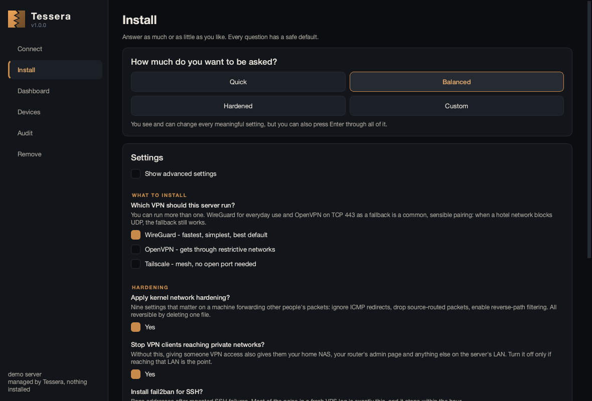
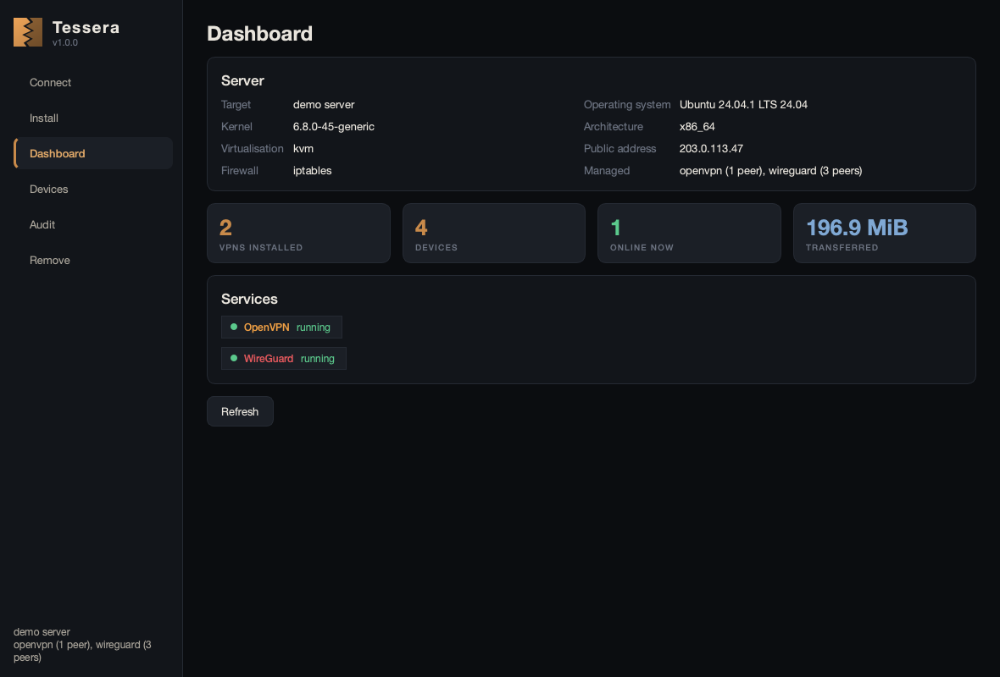
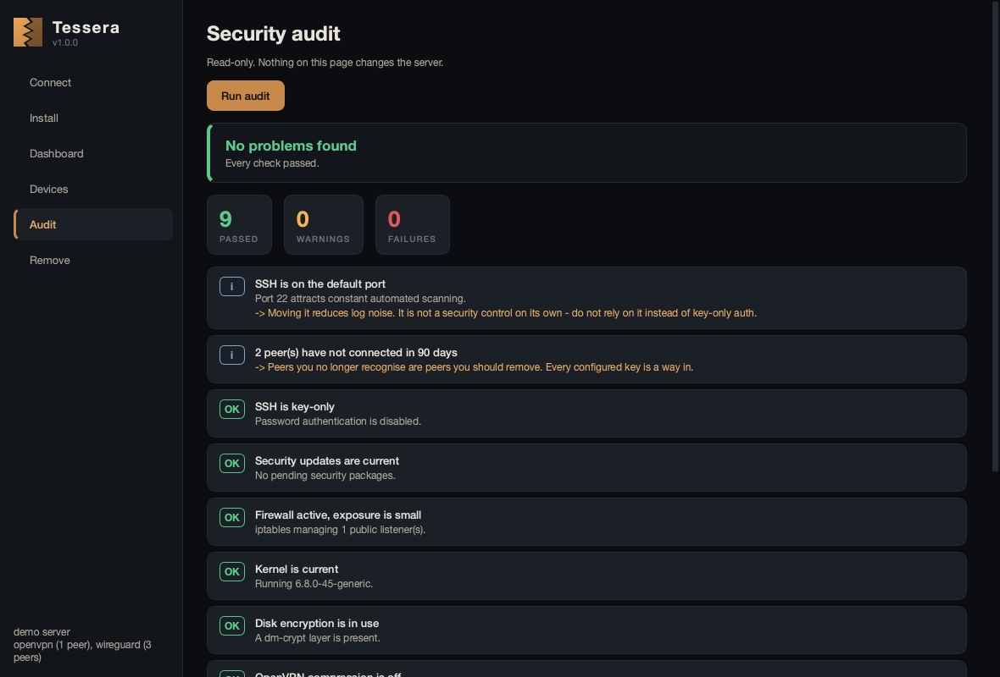
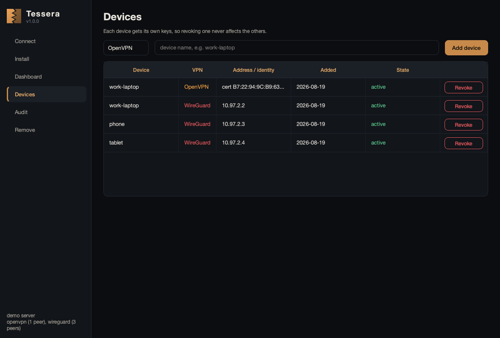
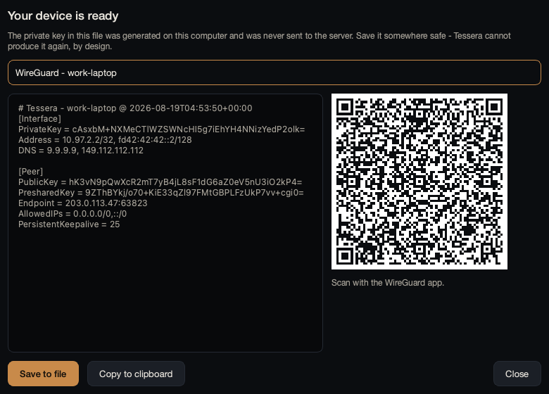

<div align="center">


**Install, configure and remove WireGuard, OpenVPN and Tailscale on any Linux server — from any desktop.**

[](LICENSE)
[](https://www.python.org/)
[]()

[Quick start](#quick-start) · [How it works](#how-it-works) · [Why it is built this way](#four-decisions-that-shape-everything) · [CLI](#the-cli) · [Uninstalling](#uninstalling)

</div>

---

## What this is

A single tool that sets up a VPN server properly, explains every choice while it
does it, and can take the whole thing off again cleanly.

It has a desktop app and a command line that do exactly the same things, because
they are two faces of the same engine.

```bash
pip install "tessera-vpn[all]"
tessera install root@your-server.com
```

Ninety seconds later you have a hardened WireGuard server, a config file for your
laptop, and a QR code for your phone.

**Try it with no server at all:**

```bash
tessera install demo --dry-run
```

That runs the entire flow against a simulated Ubuntu box and prints the exact plan
it would execute. Nothing is installed, nothing is contacted. The simulated
server lives in memory for one process, so it resets between commands — use
`tessera gui` and connect to `demo` to click through the whole lifecycle.

---

## Screenshots

| The plan, before anything runs | The interview |
|---|---|
|  |  |

| Dashboard | Security audit |
|---|---|
|  |  |

| Devices | Your new device |
|---|---|
|  |  |

---

## The name

A *tessera hospitalis* was a small token — clay or bronze — that two people
deliberately snapped in two. The host kept one half, the guest took the other.
Years later, either party or their descendants could prove the bond by producing
their half and watching the broken edges mate.

Neither half means anything on its own. Forgery is hopeless because the fracture
is unrepeatable.

That is a keypair, two thousand years early, and it is the idea the whole project
is built on: your device holds one half, the server holds the other, and the
tunnel exists because the halves fit.

---

## Quick start

### Install Tessera on your own computer

```bash
pip install "tessera-vpn[all]"
```

Tessera runs on **macOS, Windows and Linux**. The *server* it configures must be
Linux — that is where WireGuard and OpenVPN actually run.

### Set up a server

```bash
tessera install root@vpn.example.com
```

It will:

1. Inspect the server (read-only) — distribution, kernel, virtualisation,
   firewall, what is already installed.
2. Ask you some questions, each with a safe default and an explanation of what
   happens if you choose wrongly.
3. Show you a numbered plan of every command it intends to run.
4. Run it, and hand you a client config plus a QR code.

Prefer to click? `tessera gui`

### Add a device later

```bash
tessera peer add phone root@vpn.example.com
```

### Check it is still healthy

```bash
tessera audit root@vpn.example.com
```

### Take it all off

```bash
tessera uninstall root@vpn.example.com
```

---

## How it works

Tessera is a **control plane**. It runs on your desktop and drives the server
through a `Transport`:

```
  your laptop                              your server
  ┌──────────────────────────┐             ┌────────────────────────┐
  │  GUI          CLI        │             │                        │
  │    └──────┬─────┘        │             │   wireguard / openvpn  │
  │        Session           │             │   / tailscale          │
  │           │              │             │                        │
  │    Plan → Executor       │             │   /etc/tessera/        │
  │           │              │──── ssh ───▶│      state.json        │
  │       Transport          │             │                        │
  └──────────────────────────┘             └────────────────────────┘
        keys are born here                    only public keys arrive
```

**Nothing is installed on the server.** No agent, no daemon, no Python. Tessera
sends shell commands over your existing SSH connection and reads the results.

SSH goes through your system's own `ssh` binary rather than an embedded library.
That is deliberate:

- It exists on macOS, on every Linux, and on Windows 10+ — so "works on any OS"
  costs zero dependencies.
- It reads `~/.ssh/config`, so `Host prod` aliases, `ProxyJump` bastions and
  per-host keys all work with no code from us.
- It uses your ssh-agent, so hardware keys (YubiKey, Secure Enclave, FIDO) work.
- Host key verification is OpenSSH's own, against your real `known_hosts`. We
  never get the chance to write a "just trust it" code path, because we never
  implement trust at all.

Connection reuse is handled with ControlMaster multiplexing, so a forty-step
install is one TCP handshake and one authentication, not forty.

---

## Four decisions that shape everything

### 1. Client private keys are generated on your machine, never on the server

The installers this project takes reference from run `wg genkey` **on the server**
for every client, write the private key into a file in someone's home directory,
and leave it there. The server has therefore held, logged and still stores the
private half of every device that will ever connect to it.

Tessera generates the keypair on your desktop and uploads only the **public** key.
The server is told whom to trust; it is never told the secret.

For OpenVPN this uses the flow every certificate authority has used for thirty
years: your machine generates the key, builds a **certificate signing request**
containing only the public half plus a self-signature proving possession, and the
server's CA signs that. `easyrsa import-req` and `sign-req`, not
`build-client-full`.

**What this buys you:** if your server is compromised tomorrow, the attacker
learns which devices are allowed in. They cannot become any of them.

The price is honest and stated everywhere it matters: Tessera cannot re-issue a
config you have lost. There is nothing to re-issue it from. You create a new
device and revoke the old one.

### 2. Every change is a plan you can read first

Nothing is executed directly. Every operation — install, add device, harden,
remove — first compiles into an ordered list of steps, each carrying the exact
command, why it exists, and how to undo it.

```
  5/15  Generate the server private key
        Redirected straight into a 0600 file, so the key is never an argument in
        ps output or a line in shell history.
        <secret command hidden>

  6/15  Write the firewall helper
        Keeping NAT rules in one reviewable script — instead of a wall of PostUp
        lines — means the uninstaller can undo them exactly.
        write /etc/tessera/wg-wg0-firewall.sh <2604 bytes, mode 0700>
```

Because of this, `--dry-run` is not a separate code path that can drift from the
real one. It is the same plan, printed instead of run. **What you review is
literally what executes.**

It also means failure is not ambiguous. Every step that ran is recorded, so a
failed install rolls back in reverse using each step's own undo command.

### 3. The uninstaller works from an inventory, not from a guess

This is the biggest functional difference from the scripts Tessera takes
reference from, and it is worth explaining properly.

Their uninstall path is a fixed list written by a human: `rm -rf /etc/wireguard`,
`apt-get remove wireguard`, and so on. It removes what the author remembered on
the day they wrote it. It cannot know that *your* install also added an nftables
table, a sysctl drop-in, a systemd unit, and a package that something else on the
box now depends on. So it either leaves debris behind or removes something you
still needed.

Tessera writes down **every single thing it creates, at the moment it creates
it** — each file, package, service, firewall rule and kernel setting — and,
crucially, whether that thing *already existed before we got here*.

```json
{ "kind": "package", "ref": "wireguard-tools", "pre_existing": false },
{ "kind": "package", "ref": "iptables",        "pre_existing": true  },
{ "kind": "sysctl",  "ref": "net.ipv4.ip_forward", "pre_existing": true }
```

Removal walks that list backwards and deletes exactly the entries Tessera added.

**Install a VPN on a box that already had iptables, and Tessera will not
uninstall iptables.** IP forwarding you had already enabled stays enabled. That
is the entire point.

Package removal also passes `--no-autoremove`, so dependency cleanup can never
cascade into breaking an unrelated service during what you thought was a VPN
uninstall.

### 4. The audit does not grade on a curve

Scores out of a hundred are comforting and wrong. They average one fatal flaw
together with nine cosmetic passes and hand you a B.

Tessera returns findings, and the **worst** finding sets the verdict. One failure
fails the audit no matter how many checks passed, because that is how security
actually works. A server with perfect ciphers and password SSH login is not a
good server.

---

## What gets installed

<table>
<tr><th width="140">Engine</th><th>What it is good at</th><th>What it costs you</th></tr>
<tr valign="top"><td><b>WireGuard</b><br><i>the default</i></td>
<td>
Fastest of the three and the only one in the Linux kernel.<br>
Roams between Wi-Fi and mobile without dropping.<br>
Unsolicited packets get no reply at all, so scanners see nothing.<br>
The config is short enough to read in full.
</td><td>
Every peer needs a fixed VPN IP.<br>
No usernames or MFA — the key <i>is</i> the identity.<br>
UDP only, so it is blocked where only TCP 443 is allowed.
</td></tr>
<tr valign="top"><td><b>OpenVPN</b></td><td>
Gets through hostile networks by speaking TCP 443, where it is
indistinguishable from HTTPS.<br>
Real certificate revocation — a revoked client is dead even though it still
holds its key.<br>
A client exists for every platform made in twenty years.
</td><td>
Runs in userspace, so several times slower.<br>
Large config surface, most of which can be set unsafely.<br>
Roaming forces a full renegotiation.
</td></tr>
<tr valign="top"><td><b>Tailscale</b></td><td>
No inbound port at all, so it works behind CGNAT and on any hotspot.<br>
Every device reaches every other directly, not through one server.<br>
Log in with an identity provider instead of shipping keys around.
</td><td>
Key distribution goes through a coordination server you do not own — unless you
self-host <b>Headscale</b>, which Tessera supports.<br>
Free tier caps users and devices.
</td></tr>
</table>

You can install more than one. WireGuard for everyday use plus OpenVPN on TCP 443
as a fallback is a common, sensible pairing: when a hotel network blocks UDP, the
fallback still works.

### Defaults, and why

| Setting | Default | Reasoning |
|---|---|---|
| WireGuard port | random, 49152–65535 | Not a security control. It keeps you out of the constant background noise aimed at 51820, which makes your logs readable. |
| VPN subnet | random inside `10/8` | Half the world's routers are `192.168.1.0/24`. A collision with the network your client is sitting on breaks routing in a way that is miserable to debug. |
| Preshared key | always set | Sits on top of the Curve25519 handshake. An adversary recording traffic today and breaking Curve25519 with a quantum computer later still faces a 256-bit symmetric secret they never saw on the wire. It costs nothing. |
| DNS | Quad9 | If you route all traffic but keep your old resolver, every site you visit still leaks to it — the exact leak the VPN was meant to close. |
| OpenVPN cipher | AES-256-GCM | AEAD: no separate MAC to get wrong, no CBC padding oracle. Tessera does not offer CBC options at all. |
| OpenVPN certs | ECDSA P-256 | Same security as RSA-3072 with a handshake an order of magnitude cheaper, which is noticeable on a small VPS. |
| Control channel | `tls-crypt-v2` | A separate key per client. A leaked client key does not let an attacker probe the server as anyone else, and scanners cannot identify the port. |
| Compression | **off, always** | Compressing before encrypting leaks plaintext length. That is the VORACLE attack. There is no safe way to enable it. |
| Private networks | blocked from VPN clients | Without this, giving a friend VPN access also gives them your home NAS and your router's admin page. |

---

## The CLI

```
tessera install    [target]   install and configure a VPN
tessera status     [target]   what is running and who is connected
tessera peer       add|list|remove
tessera audit      [target]   check the server's security posture
tessera uninstall  [target]   remove cleanly, shredding key material
tessera doctor     [target]   inspect a server without changing it
tessera gui                   launch the desktop application
```

`[target]` is `user@host[:port]`, or omitted for this machine, or `demo` for the
simulator.

```bash
# See exactly what would happen, change nothing
tessera install root@box --dry-run

# Fully non-interactive, for provisioning
tessera install root@box --yes --engine wireguard --endpoint vpn.example.com

# Both engines, hardened profile
tessera install root@box -e wireguard -e openvpn --profile paranoid

# Inspect before committing to anything
tessera doctor root@box
```

Exit codes: `0` fine, `1` error, `2` blocked by preflight, `3` audit failed —
so `tessera audit` drops straight into CI.

Full reference: [docs/CLI.md](docs/CLI.md)

---

## Uninstalling

```bash
tessera uninstall root@vpn.example.com --dry-run   # see the removal plan first
tessera uninstall root@vpn.example.com
```

You are asked to type `REMOVE`. Then:

- Services stop before their configuration is deleted, and firewall rules come
  down before the script that removes them is itself removed. Doing it forwards
  strands rules with nothing left to remove them.
- Private keys are **shredded** — overwritten before being unlinked.
- Anything marked `pre_existing` is left completely alone.
- A final check confirms the ports really are closed, rather than assuming the
  stop command worked.

Partial removal works too:

```bash
tessera uninstall root@box --engine openvpn      # keep WireGuard
tessera uninstall root@box --keep-hardening      # keep fail2ban, sysctls, SSH policy
```

**An honest note about shredding.** `shred` overwrites in place, which genuinely
destroys data on a spinning disk. On SSDs, on copy-on-write filesystems (btrfs,
ZFS) and on any journalling filesystem it may not, because the controller or the
filesystem can write the overwrite somewhere else and leave the original block
intact. Tessera still does it — it is strictly better than `unlink` — but full-disk
encryption is the only real guarantee, which is why the audit mentions it.

---

## Installing without pip

Tessera is plain Python with one required dependency. You can run it from a clone:

```bash
git clone https://github.com/at0m-b0mb/Tessera
cd Tessera
pip install cryptography          # required
pip install rich qrcode PyQt6     # optional: nicer CLI, QR codes, GUI
python3 -m tessera --help
```

---

## Documentation

| Document | What is in it |
|---|---|
| [docs/ARCHITECTURE.md](docs/ARCHITECTURE.md) | Every module, what it does, and why it is separate |
| [docs/SECURITY-MODEL.md](docs/SECURITY-MODEL.md) | Threat model, what Tessera does and does not protect against |
| [docs/CLI.md](docs/CLI.md) | Full command reference |
| [docs/UNINSTALL.md](docs/UNINSTALL.md) | The inventory format and removal in detail |
| [CONTRIBUTING.md](CONTRIBUTING.md) | How to add an engine or a distribution |

---

## Supported servers

| Distribution | Versions |
|---|---|
| Debian | 10+ |
| Ubuntu | 20.04+ |
| Fedora | 32+ |
| RHEL / Rocky / AlmaLinux / Oracle | 8+ |
| Arch / Manjaro | rolling |
| Alpine | 3.x |
| openSUSE | Leap 15+, Tumbleweed |

Tessera refuses rather than guesses: OpenVZ containers cannot load kernel modules
or create TUN devices, and it will say so before installing anything instead of
failing halfway.

---

## Credits

The `wireguard-install` and `openvpn-install` scripts by
[angristan](https://github.com/angristan) are the reference for this project. The
package selection per distribution, the Easy-RSA sequence and a good deal of hard-won
knowledge about what breaks on which distro come from reading them carefully.
Tessera differs in structure — plans instead of straight-line bash, an inventory
instead of a fixed removal list, and client keys generated locally — but those
scripts did the archaeology first, and this would have been much harder without them.

## License

MIT — see [LICENSE](LICENSE).
